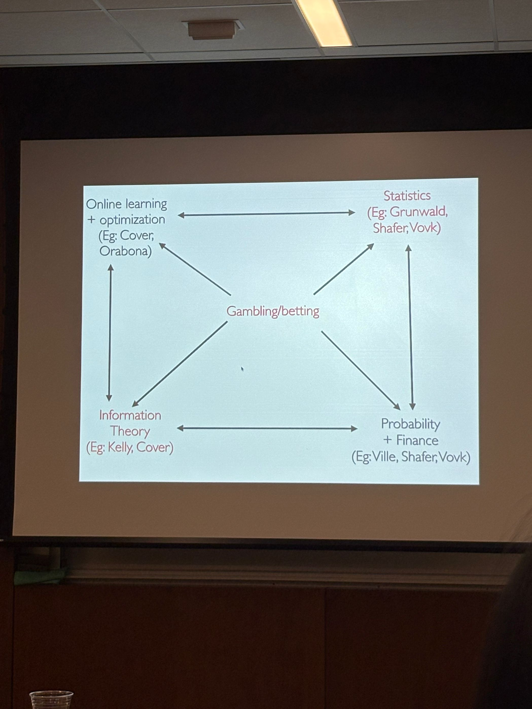
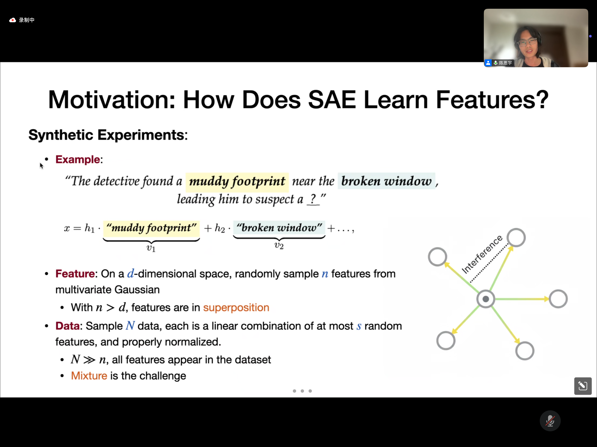

This is the note taken in [**Wharton Statistics seminar**](https://statistics.wharton.upenn.edu/research/seminars-conferences/), [**FOLDS Seminar**](https://jasonaltschuler.github.io/folds-seminar/) (Optimization & Learning), [**ASSET Seminar**](https://asset.seas.upenn.edu/events/) (Safety), [**Theory seminar**](https://theory.cis.upenn.edu/seminar/) and external seminars. It is mainly for writing down things / resources that I learn from the seminars, and they are not guaranteed to be comprehensive or accurate. 

## Statistics Seminar (Sep 3rd 2025)
> Speaker: Aaditya Ramdas, CMU
> 
> Title: The Numeraire e-variable and Reverse Information Projection
> 
> [Paper](https://arxiv.org/pdf/2402.18810)

[Jonathan Li (Barron's student at Yale Stats)'s PhD Thesis on Estimation of Mixture models](http://www.stat.yale.edu/~arb4/students_files/JonathanLiThesis.pdf)

[Information Projection](https://en.wikipedia.org/wiki/Information_projection): Projecting a probability distribution $q$ onto a set of distribution $P$.

Other areas that have relationships with gambling: 

Many people here I haven't heard about, need to research later.

Useful / Latest Online learning [lecture note](https://arxiv.org/pdf/1912.13213)

Classical works on bets: [A New Interpretation of Information Rate](https://www.princeton.edu/~wbialek/rome/refs/kelly_56.pdf), [Optimal gambling systems for favorable games](http://www-stat.wharton.upenn.edu/~steele/Resources/FTSResources/KellyBreiman/Breiman61.pdf).

## FOLDS Seminar (Sep 4th 2025)
> Speaker: Joel Tropp, Caltech
>
> Title: Positive random walks and positive-semidefinite random matrices
>
> Paper: https://arxiv.org/abs/2501.16578

If we consider (normalized) positive random walk on the real line, i.e. $W \geq 0$, and $\mathbb{E}[W^2] < + \infty$. We consider the random walk $Y = \frac{1}{n} W_i$ where $W_i \sim W$ and $\mathbb{E}[Y] = \mathbb{E}[W]$.

To have $Y \gg \mathbb{E}[Y]$ need to exist one large step $W_i$, to have $Y \ll \mathbb{E}[Y]$ then we need to have all steps $W_i$ small. Therefore the right tail would look heavy-tail i.e. $\sim (nt)^{-2}$, and left tail behaves like light tail i.e. have exponential rate $e^{-nt^2}$.

We are able to show that the left tail has subGaussian behavior and can be approximately characterized by a Gaussian $Z \sim \mathcal{N}( \mathbb{E}W, \frac{1}{n} \mathbb{E}W^2)$ using Paley–Zygmund inequality ([Kind of second moment method](https://en.wikipedia.org/wiki/Second_moment_method)).

Then we extend the discussions to PSD matrices $W_i$, we are curious about lower bounds of $\lambda_{\min}(Y)$, which describes (quantitative) injectivity. We can write it as

$$
\lambda_{\text{min}}(Y) = \min_{\| u \|_2 = 1} \frac{1}{n} \sum_{i=1}^n u^\top W_i u.
$$

where the inside term is the "positive random walk" which hates to be zero, and the outside is to find the "worst direction" to minimize the term.

Here, the useful thing to deal with high-dimensional Gaussian is that, if we are dealing with symmetric $d \times d$ matrix $Z$, then it is Gaussian iff $\text{Tr}[MZ] $ is real Gaussian for each $M$ which is a $d \times d$ symmetric matrix.

Would be able to establish the Gaussian comparison i.e. $\lambda_{\min}$ of $Y$ and Gaussian $Z$, with some correction term (2.4 in Paper). An important application of this paper is the sparse random vector. It may also have applications in dimension reduction. 

https://arxiv.org/pdf/2012.11654 might related to lowest eienvalue of NTK also?

## FAI Seminar (Sep 4th 2025)

>  Speaker: Siyu Chen, Yale
>
>  Title: Polysemanticity in language models
>
> Paper: https://arxiv.org/abs/2506.14002

Superposition: # Representated features $\gg$ embedding dimension.

Polysemantic neurons - activating for many concepts.

Drawback of previous methods: 
1. L1 regularization: activation shrinkage (When L2 loss is small to some degree, L1 regularization would dominate the loss)
2. TopK: Sensitive to randomness and inconsistent in feature recovery.

Synthetic setup:

This paper uses theory to classify different superposition regime and finds SAE can learn feature while activation frequency $p = O(s/n)$ where $s$ stands for data sparsity and $n$ is total number of features. 

Idea of this paper: Use different sets of biases to "resonate" with different frequencies of features in data. 

Training dynamics theory idea: Overparametrization ensures there exists some neuron at initialization aligns better with the signal. Then we decompose the signal and noise, and shows that after iterations it would turn to learning the signal.

Follow-up work on transcoder. This paper worths diving into later.